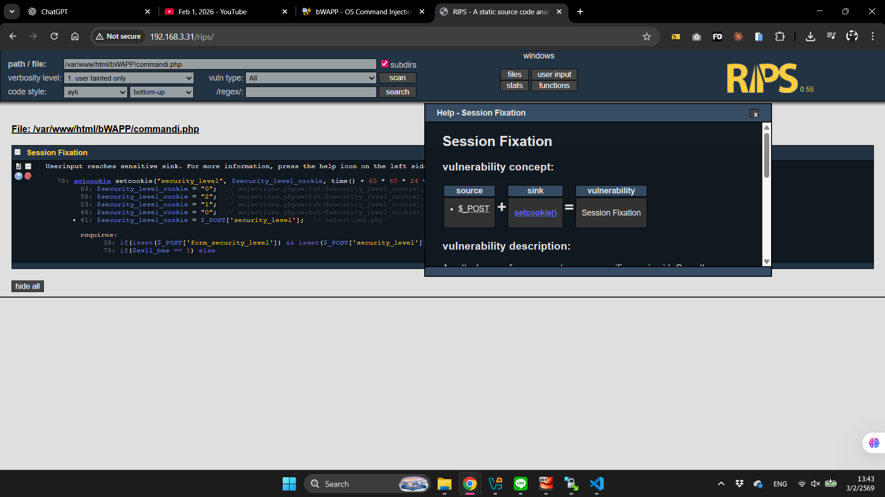
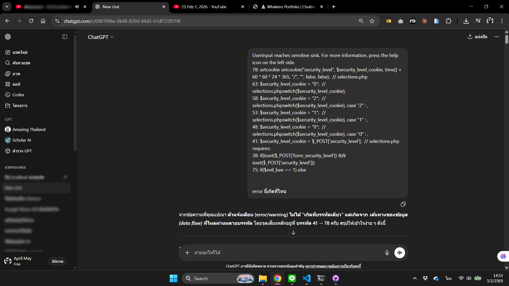
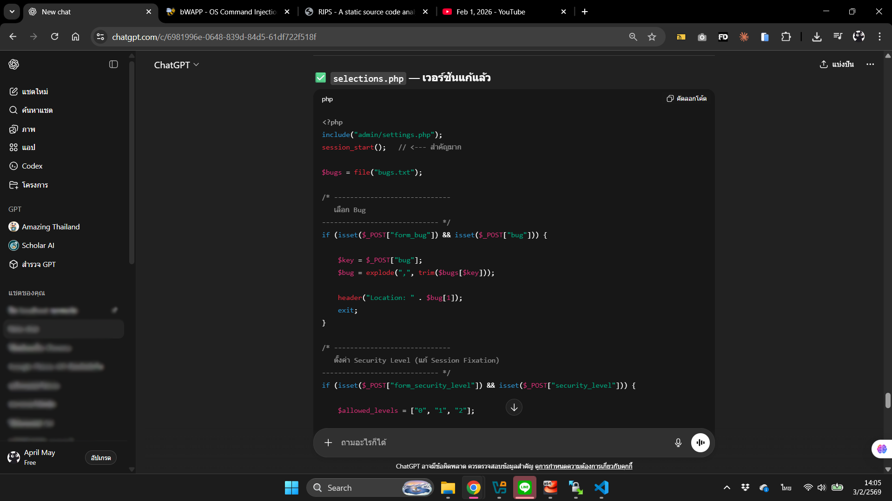
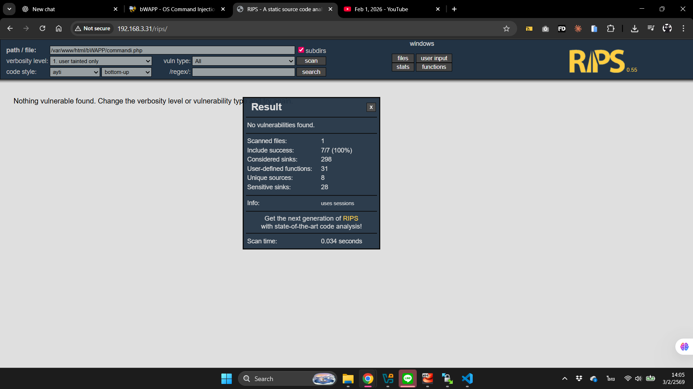

# 🔒 Session Fixation

> _วิธีการแก้ไขปัญหา Session Fixation ที่เช็คผ่าน RIPS (เนื้อหาวันที่ 1 กุมภาพันธ์ 2569)_

---

## ปัญหาที่ RIPS เจอ
อีก 1 ปัญหาที่เหลือหลังจากจบการเรียน คือ Session Fixation


---

## วิธีการแก้ไข

### 1. ดูรายละเอียดของปัญหา
ทางซ้ายมือจะมีปุ่ม get help (เครื่องหมาย ? สีฟ้า)ปุ่มนี้จะคอยบอกรายละเอียด มีคำอธิบาย ว่าจะต้องทำยังไงเพื่อแก้ไขปัญหานี้ ซึ่งถ้าเรากดเข้าไปดูก็จะเห็นรายละเอียดที่บอกว่า

#### Session Fixation

**Vulnerability Concept:**

| Source | Sink | Vulnerability |
|--------|------|---------------|
| `$_POST` + | `setcookie()` | = Session Fixation |

**Vulnerability Description:**
An attacker can force a user to use a specific session id. Once the user logs in, the attacker can use the previously fixated session id to access the account.

More information about Session Fixation can be found here.

---

**Vulnerable Example Code:**
```php
// 1:
setcookie("PHPSESSID", $_GET["sessid"]);
```

**Proof of Concept:**
```
/index.php?sessid=1f3870be274f6c49b3e31a0c6728957f
```

**Patch:**
Do not use a session token supplied by the user.
```
1: No code.
```

**Related Securing Functions:**
None.

---




### 2. เปิด WinSCP
เมื่อลองเข้าไปใน server ผ่าน WinSCP และเปิดไฟล์ดู พอเทียบกับในที่ RIPS แจ้ง error จะเห็นว่ามันใบ้เป็น comment อยู่แล้วว่าไฟล์ไหน ซึ่งในกรณีนี้คือ selections.php


### 3. เปิดไฟล์ผ่าน Visual Studio Code
ต่อไปลองเปิดไฟล์นั้นใน VS Code ดู เพื่อจะได้แก้ไขได้สะดวกขึ้น


### 4. แก้ไขจุดที่มีปัญหา
เนื่องจากปัญหาอาจจะยากเกินกว่าลิงจะเข้าใจ และ get help ไม่สามารถช่วยอะไรเราได้ เราสามารถปรึกษา Ai และเอาโค้ดเดิมที่มีปัญหาของเราส่งไปเพิ่มเติม เพื่อให้ Ai ได้เข้าใจบริบทที่เราเจออยู่ตอนนี้มากขึ้น และมีโอกาสแก้ไขให้เราได้ถูกต้องมากกว่าตอนที่มันไม่เห็นอะไรจากเราเลยนอกจากคำถามลอย ๆ

**4.1**


**4.2**



### 5. แทนที่ไฟล์
หลังจากแก้ไขเสร็จแล้ว ให้เซฟ และนำไฟล์ที่พึ่งแก้เสร็จ ไปแทนที่กับอันเก่าที่อยู่บน server (ควรจะ backup ไฟล์ดั้งเดิมไว้ก่อนจะทำขั้นตอนนี้ เผื่อกรณีไฟล์ที่แก้นั้นทำเละกว่าเดิม T^T)


### 6. DONE!
เช็คผ่าน RIPS อีกครั้งว่าปัญหานั้นยังอยู่ไหม ถ้าเป็น 0 แล้วก็น่าจะใช้ได้แล้ว



---

[← กลับหน้าแรก](README.md)
