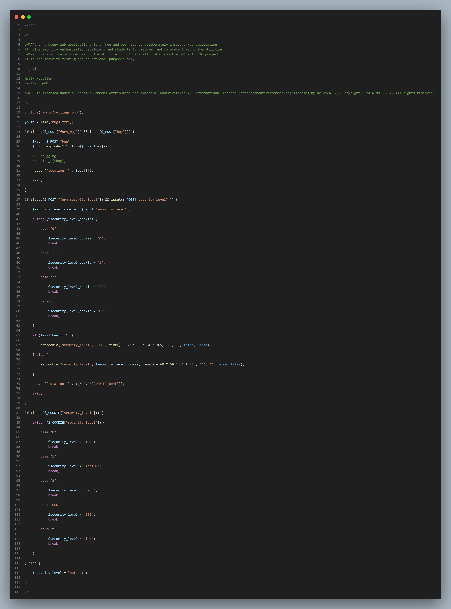
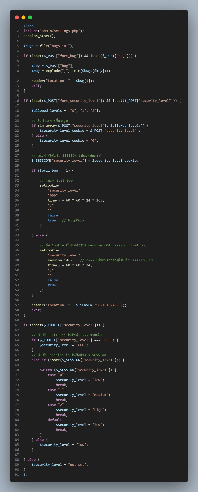
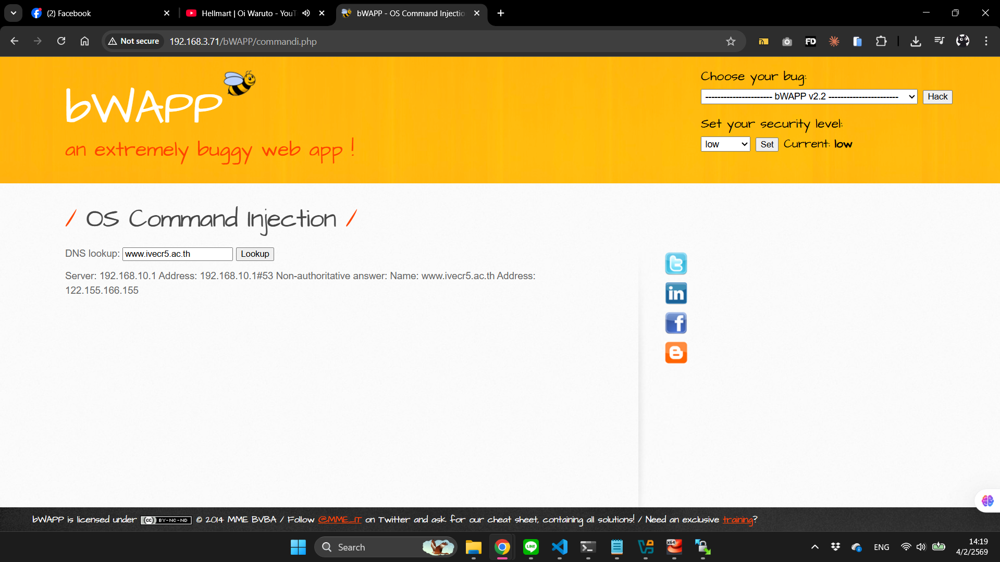

# 🔒 Session Fixation

> _วิธีการแก้ไขปัญหา Session Fixation ที่เช็คผ่าน RIPS (เนื้อหาวันที่ 1 กุมภาพันธ์ 2569)_

---

## ปัญหาที่ RIPS เจอ
อีก 1 ปัญหาที่เหลือหลังจากจบการเรียน คือ Session Fixation จากการค้นหาคร่าว ๆ AI ได้สรุปมาว่า Session Fixation คือการที่ผู้โจมตีบังคับให้ผู้ใช้งานใช้ session ID ที่พวกเขากำหนดไว้เอง พอผู้ใช้ login เข้าไปแล้ว ผู้โจมตีก็สามารถใช้ session ID อันนั้นเข้า account และสวมรอยได้เลย


---

## วิธีการแก้ไข

### 1. ดูรายละเอียดของปัญหา
ทางซ้ายมือจะมีปุ่ม get help (เครื่องหมาย ? สีฟ้า) ปุ่มนี้จะคอยบอกรายละเอียด มีคำอธิบาย ว่าจะต้องทำยังไงเพื่อแก้ไขปัญหานี้ ซึ่งถ้าเรากดเข้าไปดูก็จะเห็นรายละเอียดที่บอกว่า

#### Session Fixation
**Vulnerability Concept:**

| Source | Sink | Vulnerability |
|--------|------|---------------|
| `$_POST` + | `setcookie()` | = Session Fixation |

**Vulnerability Description:**
An attacker can force a user to use a specific session id. Once the user logs in, the attacker can use the previously fixated session id to access the account.

More information about Session Fixation can be found here.
---
**Vulnerable Example Code:**
```php
// 1:
setcookie("PHPSESSID", $_GET["sessid"]);
```
**Proof of Concept:**
```
/index.php?sessid=1f3870be274f6c49b3e31a0c6728957f
```
**Patch:**
Do not use a session token supplied by the user.
```
1: No code.
```
**Related Securing Functions:**
None.

---


### 2. เปิด WinSCP
เมื่อลองเข้าไปใน server ผ่าน WinSCP และเปิดไฟล์ดู พอเทียบกับในที่ RIPS แจ้ง error จะเห็นว่ามันใบ้เป็น comment อยู่แล้วว่าไฟล์ไหน ซึ่งในกรณีนี้คือ selections.php


### 3. เปิดไฟล์ผ่าน Visual Studio Code
ต่อไปลองเปิดไฟล์นั้นใน VS Code ดู เพื่อจะได้แก้ไขได้สะดวกขึ้น


### 4. แก้ไขจุดที่มีปัญหา
เนื่องจากปัญหาอาจจะยากเกินกว่าลิงจะเข้าใจ และ get help ไม่สามารถช่วยอะไรเราได้ เราสามารถปรึกษา AI และเอาโค้ดเดิมที่มีปัญหาของเราส่งไปเพิ่มเติม เพื่อให้ AI ได้เข้าใจบริบทที่เราเจออยู่ตอนนี้มากขึ้น และมีโอกาสแก้ไขให้เราได้ถูกต้องมากกว่าตอนที่มันไม่เห็นอะไรจากเราเลยนอกจากคำถามลอย ๆ

**4.1** ก่อนแก้


**4.2** หลังแก้



จุดเปลี่ยนแปลงสำคัญ:
- เพิ่ม `session_start()` (บรรทัด 3) - เปิดใช้งาน PHP Session
- Validate input ด้วย `in_array()` (บรรทัด 18-24) - รับเฉพาะค่า `"0"`, `"1"`, `"2"` เท่านั้น
- เก็บค่าจริงใน `$_SESSION` (บรรทัด 28) แทนการเก็บใน cookie ตรงๆ
- ใช้ `session_id()` ใน cookie (บรรทัด 48) แทนค่าที่ผู้ใช้ส่งมา → ป้องกัน Session Fixation
- เปิด `httpOnly = true` (บรรทัด 52) - JavaScript เข้าถึง cookie ไม่ได้
- อ่านค่าจาก `$_SESSION` (บรรทัด 68-80) แทนการอ่านจาก cookie โดยตรง

---

### 5. แทนที่ไฟล์
หลังจากแก้ไขเสร็จแล้ว ให้เซฟ และนำไฟล์ที่พึ่งแก้เสร็จ ไปแทนที่กับอันเก่าที่อยู่บน server (ควรจะ backup ไฟล์ดั้งเดิมไว้ก่อนจะทำขั้นตอนนี้ เผื่อกรณีไฟล์ที่แก้นั้นทำเละกว่าเดิม T^T)


### 6. DONE!
เช็คผ่าน RIPS อีกครั้งว่าปัญหานั้นยังอยู่ไหม ถ้าเป็น 0 แล้วก็น่าจะใช้ได้แล้ว


### 7. ทดสอบการทำงานหลังแก้ไข

หลังจากแก้ไขโค้ดแล้ว จำเป็นต้องทดสอบว่า functionality ยังทำงานได้ปกติ เพื่อให้มั่นใจว่าการแก้ช่องโหว่ไม่ได้ทำให้ระบบเสีย

สิ่งที่เราแก้ไป:
- เปลี่ยนจาก: เก็บค่า security level โดยตรงใน cookie (ผู้ใช้แก้ไขได้)
- เป็น: เก็บค่าจริงใน `$_SESSION` และใช้ `session_id()` ใน cookie แทน
- เปิด `httpOnly = true` เพื่อป้องกัน JavaScript เข้าถึง cookie

ทำไมวิธีนี้ถึงปลอดภัย:
- ผู้โจมตีไม่สามารถบังคับค่า security level ผ่าน cookie ได้โดยตรง
- ค่าจริงถูกเก็บใน server-side session ที่ผู้ใช้แก้ไขไม่ได้
- Cookie เก็บเฉพาะ session identifier ที่ randomize โดย PHP

ผลการทดสอบ:


การทดสอบที่ทำ:
- ระบบ DNS Lookup ยังใช้งานได้ - แสดงผล DNS query ปกติ (`www.ivecr5.ac.th` → `122.155.166.155`)
- Session ไม่หลุด - ค่า security level ที่เลือกไว้ยังคงอยู่ตลอดการใช้งาน

สรุป: ระบบทำงานได้ครบถ้วนเหมือนเดิม แต่ ปิดช่องโหว่ Session Fixation แล้ว โดยผู้โจมตีไม่สามารถกำหนด session ID ให้ผู้ใช้ได้อีกต่อไป
---

[← กลับหน้าแรก](README.md)
