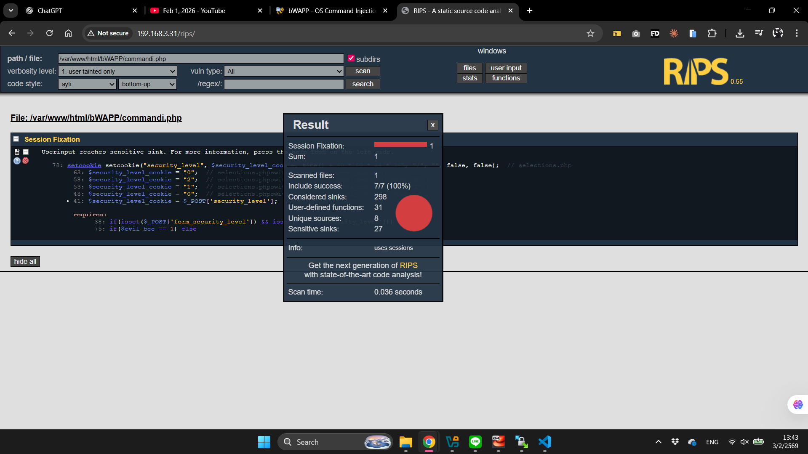
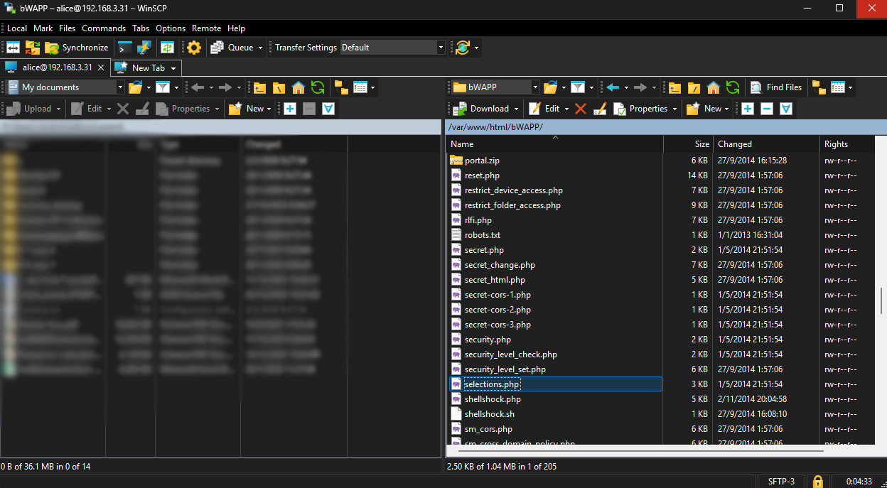
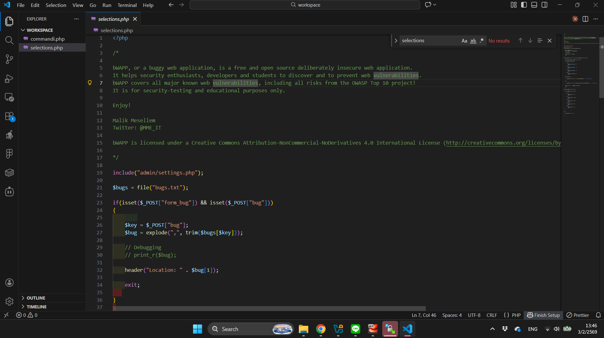
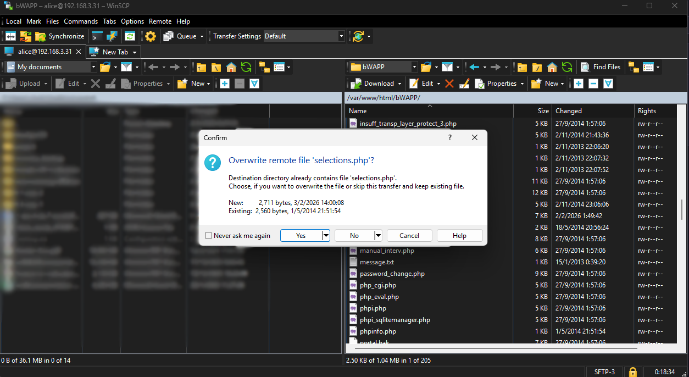

# 🔒 Web Security

> _วิธีการแก้ไขปัญหา Web Security ที่เช็คผ่าน Rips (เนื้อหาวันที่ 1 กุมภาพันธ์ 2569)_

---

## ปัญหาที่ Rips เจอ
อีก 1 ปัญหาที่เหลือหลังจากจบการเรียน

---

## วิธีการแก้ไข

### 1. ดูรายละเอียดของปัญหา
ทางซ้ายมือจะมีเครื่องหมาย ? สีฟ้าเขียนว่า "get help" ปุ่มนี้จะคอยบอกรายละเอียด มีคำอธิบาย ว่าจะต้องทำยังไงเพื่อแก้ไขปัญหานี้

### 2. เปิด WinSCP
Login เข้าไปใน WinSCP และหาไฟล์ที่มีปัญหา (จริง ๆ แล้วใน rips บรรทัดที่แจ้ง error จะมีใบ้เป็น comment จากรูปแรกอยู่ ก็คือ selections.php)

### 3. เปิดไฟล์ผ่าน Visual Studio Code
copy ไฟล์ที่มีปัญหาจากเครื่อง server มาไว้ในเครื่องตัวเอง และเปิดผ่าน text editor ที่เราคุ้นเคย

### 4. แก้ไขจุดที่มีปัญหา
เนื่องจากปัญหาอาจจะยากเกินกว่าลิงจะเข้าใจ และ get help ไม่สามารถช่วยอะไรเราได้ เราสามารถปรึกษา Ai และเอาโค้ดเดิมที่มีปัญหาของเราส่งไปเพิ่มเติม เพื่อให้ Ai ได้เข้าใจบริบทที่เราเจออยู่ตอนนี้มากขึ้น และมีโอกาสแก้ไขให้เราได้ถูกต้องมากกว่าตอนที่มันไม่เห็นอะไรจากเราเลยนอกจากคำถามลอย ๆ

**4.1**

**4.2**

### 5. แทนที่ไฟล์
หลังจากแก้ไขเสร็จแล้ว ให้เซฟ และนำไฟล์ที่พึ่งแก้เสร็จ ไปแทนที่กับอันเก่าที่อยู่บน server (ควรจะ backup ไฟล์ดั้งเดิมไว้ก่อนจะทำขั้นตอนนี้ เผื่อกรณีไฟล์ที่แก้นั้นทำเละกว่าเดิม T^T)

### 6. DONE!
เช็คผ่าน rips อีกครั้งว่าปัญหานั้นยังอยู่ไหม ถ้าเป็น 0 แล้วก็น่าจะใช้ได้แล้ว

---

[← กลับหน้าแรก](README.md)
